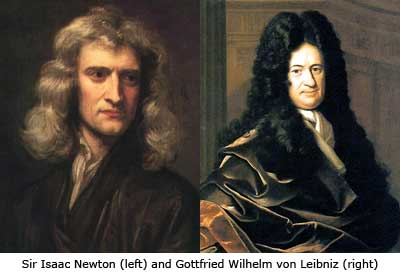
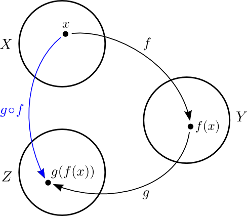
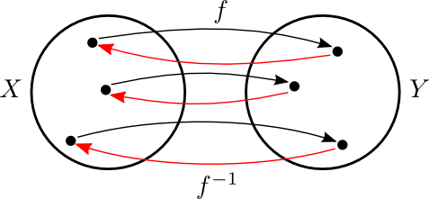

Tölur og föll
=============

Inngangur
---------

*There is a theory which states that if ever anyone discovers exactly what the Universe is for and why it is here, it will instantly disappear and be replaced by something even more bizarre and inexplicable.
There is another theory which states that this has already happened.* 

\- Douglas Adams, The Restaurant at the End of the Universe 

Grunnhugmyndin
~~~~~~~~~~~~~~

Stærðfræðigreining grundvallast á því að mæla breytingu (oft með tilliti
til tíma)

-  Eðlisfræði; hraði, hröðun, massi, orka, vinna, afl, þrýstingur

-  Rúmfræði; flatarmál, rúmmál, lengd, massamiðja

-  Hagnýtingar; hagfræði, stofnstærðir, hámörkun/lágmörkun

-  Stærðfræði; markgildi, hermun, jafnvægisástand

Sett fram samtímis, en óháð, af Isaac Newton og Gottfried Leibniz
í lok 17. aldar.

Ítarefni 
~~~~~~~~

Fyrir nánari útlistun á hugtökunum sem við fjöllum um þá er hægt að skoða
auk kennslubókarinnar

-  `http://stæ.is <http://stae.is>`__ (hugtakasafn og orðaskrá)

-  http://planetmath.org

-  http://mathworld.wolfram.com

-  http://en.wikipedia.org (ath. enska útgáfan)

Forrit
~~~~~~

-  GeoGebra http://www.geogebra.org

-  WolframAlpha http://www.wolframalpha.com

-  Matlab http://www.mathworks.com  

   (sjá https://notendur.hi.is/~jonasson/matlab/)

-  Octave http://www.gnu.org/software/octave/ (opið og ókeypis, svipað og Matlab)

-  Sage http://www.sagemath.org/  (opið og ókeypis, byggt á Python)

-  Mathematica http://www.wolfram.com/mathematica/

Skiladæmi
~~~~~~~~~

**Frágangur skiladæma**

-  Skrifið upp **dæmið** og lausnina snyrtilega

-  Vísið í setningar sem þið notið

-  Notið ekki rökfræðitákn eins og :math:`\Leftarrow`,
   :math:`\Rightarrow`, :math:`\Leftrightarrow`, :math:`\wedge`,
   :math:`\vee`

-  Textinn á að vera samfelldur og læsilegur (lesið hann sjálf yfir)

-  Skýrt svar/niðurstaða

*“Forty-two!” yelled Loonquawl. “Is that all you’ve got to show for
seven and a half million years’ work?”*

*“I checked it very thoroughly,” said the computer, “and that quite
definitely is the answer. I think the problem, to be quite honest with
you, is that you’ve never actually known what the question is.”*

-Douglas Adams, The Hitchhiker's Guide to the Galaxy 

Tölur
-----

.. index::
    seealso: rauntölur; tölur
    rauntölur
    tölur; náttúrlegar tölur
    tölur; heiltölur
    tölur; ræðar tölur
    tölur; rauntölur
    tölur; tvinntölur  
   

Skilgreining
~~~~~~~~~~~~

(i)   *Náttúrlegu tölurnar* eru tölurnar :math:`1, 2, 3, 4, \ldots` og
      mengi þeirra er táknað með :math:`{{\mathbb  N}}`.

(ii)  Mengi *heiltalna* er táknað með :math:`{{\mathbb Z}}`.
      :math:`{{\mathbb Z}}= \ldots,-2,-1,0,1,2,3,\ldots`

(iii) Mengi *ræðra talna* er táknað með :math:`{{\mathbb Q}}`.
      :math:`{{\mathbb Q}}= \{ \frac pq ; p,q \in {{\mathbb Z}}\}`.

(iv)  Mengi *rauntalna* er táknað með :math:`{{\mathbb  R}}`.

(v)   Mengi *tvinntalna* er táknað með :math:`{{\mathbb  C}}`.

.. note::
    Margir vilja telja :math:`0` með sem náttúrlega tölu. Það
    er eðlilegt ef maður lítur á náttúrlegu tölurnar þannig að þær tákni
    fjölda. Ef maður lítur hins vegar þannig á að þær séu notaðar til að
    númera hluti þá er 0 ekki með.

    
Smíði rauntalna 
~~~~~~~~~~~~~~~

Rauntölur eru smíðaðar úr ræðu tölunum með því að
fylla upp í götin.

T.d. eru

.. math::

   \begin{aligned}
   \pi &= 3,1415926\ldots, \qquad \text{og}\\
   \sqrt 2 -4  &= -2,58578\ldots\end{aligned}

ekki ræðar tölur (það er ekki hægt að skrifa þær sem brot
:math:`\frac ab`, þar sem :math:`a` og :math:`b` eru heilar tölur), en
þær eru rauntölur.

.. index::
    rauntölur; frumsendan um efra mark
    
Frumsendan um efra mark
~~~~~~~~~~~~~~~~~~~~~~~

Látum :math:`A` vera mengi af rauntölum sem
er þannig að til er tala :math:`x`, þannig að fyrir allar tölur
:math:`a \in A` þá er

.. math:: a\leq x.

Þá er til rauntala :math:`x_0` sem kallast *minnsta efra mark* fyrir
:math:`A`, sem er þannig að :math:`a\leq x_0` fyrir allar tölur
:math:`a\in
A` og ef :math:`x<x_0` þá er til tala :math:`a\in A` þannig að
:math:`a>x`.

Bil
---

.. _`Skilgreining 1.4.1`:

.. index:: bil

Skilgreining
~~~~~~~~~~~~

Látum :math:`a` og :math:`b` vera rauntölur þannig að
:math:`a<b`. Skilgreinum

(i) *opið bil* :math:`(a,b)=\{x\in {{\mathbb  R}}; a<x<b\}`

(ii) *lokað bil* :math:`[a,b]=\{x\in {{\mathbb  R}}; a\leq x\leq b\}`

(iii) *hálf opið bil* :math:`[a,b)=\{x\in {{\mathbb  R}}; a\leq x<b\}`

(iv) *hálf opið bil* :math:`(a,b]=\{x\in {{\mathbb  R}}; a< x\leq b\}`

Þessi bil sem er skilgreind hér fyrir ofan eru kölluð endanleg. Til eru
fleiri gerðir af bilum:

(v) *opið óendanlegt bil* :math:`(a,\infty)=\{x\in {{\mathbb  R}}; a<x\}`

(vi) *opið óendanlegt bil* :math:`(-\infty, a)=\{x\in {{\mathbb  R}}; x<a\}`

(vii) *lokað óendanlegt bil* :math:`[a,\infty)=\{x\in {{\mathbb  R}}; a\leq x\}`

(viii) *lokað óendanlegt bil* :math:`(-\infty, a]=\{x\in {{\mathbb  R}}; x\leq a\}`

(ix) *allur rauntalnaásinn* :math:`(-\infty, \infty)`.

.. todo:: Afhverju er númeringin svona skrítin?

Skilgreining
~~~~~~~~~~~~

Mengi :math:`A` af rauntölum kallast bil ef um allar
tölur :math:`a<b` sem eru í menginu :math:`A` gildir að ef :math:`a<x<b`
þá er :math:`x` líka í menginu :math:`A`. Þ.e. \ *engin göt*.

.. note::
    Sérhvert bil á rauntalnaásnum er af einni þeirra gerða sem talin er
    upp í `Skilgreining 1.4.1`_. Þessi staðhæfing er jafngild frumsendunni um
    efra mark.

.. note::
    Það er jafngilt að segja
    
    .. math:: x \in (a-\eta,a+\eta)

    og

    .. math:: |x-a| < \eta.

Föll
----

.. index::
    vörpun
    fall
    see: vörpun; fall

Skilgreining 
~~~~~~~~~~~~

*Vörpun* frá mengi :math:`X` yfir í mengi :math:`Y` er
regla sem úthlutar sérhverju staki :math:`x` í :math:`X` nákvæmlega einu
staki :math:`f(x)` í :math:`Y`. Táknum þetta með :math:`f:X \to Y`.

Stakið :math:`f(x)` kallast *gildi* vörpunarinnar (í punktinum
:math:`x`).

.. index::
    fall; skilgreiningarmengi
    fall; bakmengi
    fall; myndmengi

Skilgreining 
~~~~~~~~~~~~

Mengið :math:`X` kallast *skilgreiningarmengi*
:math:`f`, mengið :math:`Y` kallast *bakmengi*  
:math:`f` og mengið
:math:`f(X) = \{ f(x); x \in X \}` kallast *myndmengi* :math:`f`.

.. image:: ./myndir/kafli01/02_Mynd_vorpunar.png

.. warning:: 
    Það er ekki víst að öll gildin í :math:`Y` séu tekin
    (það er :math:`f(X)` getur verið minna en :math:`Y`). Eins þá er mögulegt
    að :math:`f` taki sama gildið oftar en einu sinni.

    
.. index::
    fall; samskeyting
    
Skilgreining 
~~~~~~~~~~~~

Látum :math:`f:X \to Y` og :math:`g:Y \to Z` vera
varpanir. Vörpunin :math:`g\circ f:X \to Z` sem skilgreind er með
:math:`(g\circ f)(x)=g(f(x))` kallast *samskeyting* :math:`f` og
:math:`g`. Stakið :math:`g(f(x)) \in Z` fæst með því að beita fyrst
vörpuninni :math:`f` á stakið :math:`x` og síðan vörpuninni :math:`g` á
stakið :math:`f(x)`.

.. index::
    fall; átækt
    fall; eintækt

Skilgreining
~~~~~~~~~~~~

Við segjum að vörpunin :math:`f` sé *átæk* ef
:math:`f(X)=Y`, það þýðir að fyrir sérhvert stak :math:`y` í :math:`Y`
þá er til (amk. eitt) stak :math:`x` í :math:`X` þannig að
:math:`f(x)=y`.

Segjum að vörpunin :math:`f` sé *eintæk* ef :math:`f(x_1) = f(x_2)`
hefur í för með sér að :math:`x_1=x_2`, það er sérhvert gildi sem vörpunin
tekur er bara tekið einu sinni.

.. index::
    fall; gagntækt

Skilgreining
~~~~~~~~~~~~

Vörpun sem er bæði eintæk og átæk kallast *gagntæk*.

.. index::
    fall; andhverfa

Setning
~~~~~~~

Látum :math:`f:X \to Y` vera vörpun. Sagt er að :math:`f`
sé andhverfanleg ef til er vörpun :math:`f^{-1}:Y \to X` þannig að
samskeyting varpananna :math:`f` og :math:`f^{-1}` annars vegar og
:math:`f^{-1}` og :math:`f` hins vegar sé viðeigandi samsemdarvörpun,
þ.e. \ :math:`f^{-1}\circ f=id_X` og :math:`f\circ f^{-1} = id_Y`.

.. note:: 
    Venjulega hjá okkur þá eru mengin :math:`X` og :math:`Y`
    mengi af rauntölum. Þegar :math:`Y` er mengi af tölum þá er notast við
    orðið *fall* í stað orðsins *vörpun*.

.. index:: 
    fall; graf
    
Skilgreining
~~~~~~~~~~~~

Látum :math:`f:X \to Y` vera fall þannig að :math:`X`
og :math:`Y` eru mengi af rauntölum. *Graf* fallsins :math:`f` er þá
mengi allra punkta í planinu :math:`{{\mathbb  R}}^2` af gerðinni
:math:`(x,f(x))` þar sem :math:`x\in X`. Hér notum við oft :math:`y` í stað
:math:`f(x)`.

.. todo:: 
    mynd
