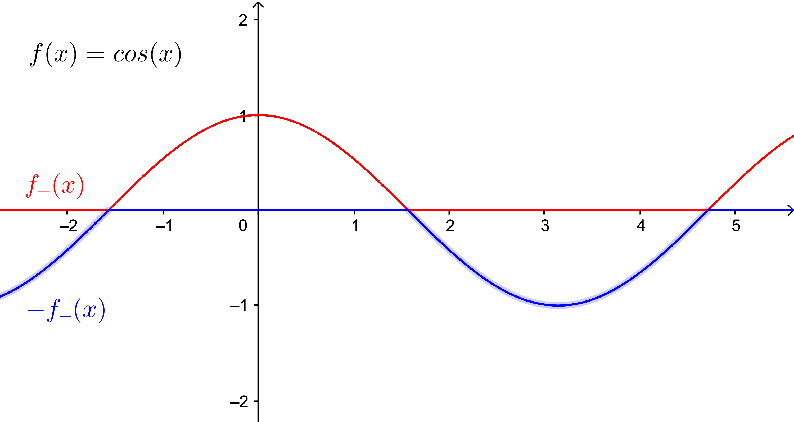
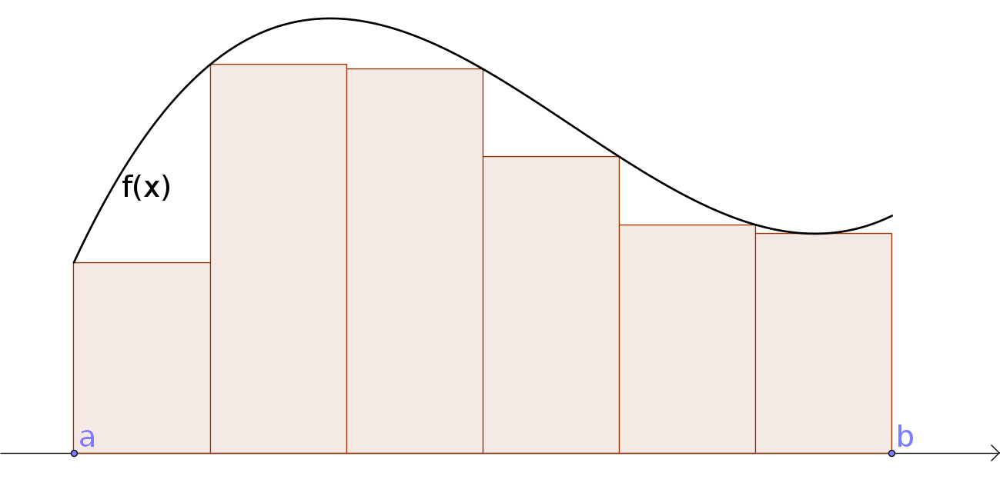
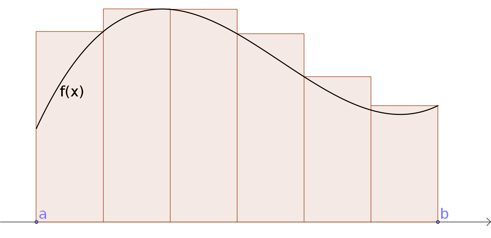

Heildun
=======

.. index::
    heildi; jákvæðs falls
    heildi
    heildismörk
    fall; heildanlegt
    flatarmál

Heildun
-------

Skilgreining: Heildi jákvæðs falls
~~~~~~~~~~~~~~~~~~~~~~~~~~~~~~~~~~

Látum :math:`f:[a,b]\rightarrow {{\mathbb  R}}` vera fall þannig að
:math:`f(x)\geq 0` fyrir öll :math:`x\in[a,b]`.

Þegar heildið :math:`\int_a^b f(x)\,dx` er skilgreint er útkoman úr því
flatarmál svæðisins sem liggur á milli :math:`x`-ás og grafs fallsins
(og afmarkast til vinstri af línunni :math:`x=a` og til hægri af línunni
:math:`x=b`).

Ef heildið :math:`\int_a^b f(x)\,dx` er skilgreint þá segjum við að
fallið :math:`f` sé *heildanlegt* yfir bilið :math:`[a,b]`.

Tölurnar :math:`a` og :math:`b` kallast *heildismörk* heildisins.

Skilgreining
~~~~~~~~~~~~

Látum :math:`f` vera fall. Skilgreinum föllin :math:`f_+` og
:math:`f_-`, sem bæði hafa sama skilgreiningarsvæði og :math:`f`, með

.. math::

   f_+(x)=\left\{\begin{array}{ll} f(x) & \mbox{ef }f(x)\geq 0,\\
     0 & \mbox{ef }f(x)<0, \end{array} \right. \qquad
     f_-(x)=\left\{\begin{array}{ll} 0 & \mbox{ef }f(x)\geq 0,\\
     -f(x) & \mbox{ef }f(x)<0. \end{array}\right.

Athugið að :math:`f(x)=f_+(x)-f_-(x)`.

Skilgreining: Heildi falls
~~~~~~~~~~~~~~~~~~~~~~~~~~

Takmarkað fall :math:`f` er *heildanlegt* yfir bilið :math:`[a, b]` ef
bæði föllin :math:`f_+` og :math:`f_-` eru heildanleg yfir bilið
:math:`[a,
b]`. Ef fallið :math:`f` er heildanlegt þá skilgreinum við heildi þess
með formúlunni

.. math:: \int_a^b f(x)\,dx=\int_a^b f_+(x)\,dx-\int_a^b f_-(x)\,dx.

.. note:: Flatarmálið sem er undir :math:`x`-ás reiknast neikvætt.

Setning
~~~~~~~

(i)  Ef fallið :math:`f` er samfellt á bilinu :math:`[a, b]` þá er
     :math:`f` heildanlegt yfir bilið :math:`[a, b]`.

(ii) Einhalla fall skilgreint á bili :math:`[a,b]` er heildanlegt.

Setning
~~~~~~~

Látum :math:`f` vera fall sem er heildanlegt yfir bilið :math:`[a, b]`.
Þá er

.. math:: \Big|\int_a^b f(x)\,dx\Big|\leq \int_a^b |f(x)|\,dx.

Eiginleikar heildisins
----------------------

Skilgreining: Heildismörkunum snúið við
~~~~~~~~~~~~~~~~~~~~~~~~~~~~~~~~~~~~~~~

Ef fallið :math:`f` er heildanlegt yfir bilið :math:`[a,b]` (hér er
:math:`a<b`) þá skilgreinum við

.. math:: \int_b^a f(x)\,dx=-\int_a^b f(x)\,dx.

Setning
~~~~~~~

(i)  :math:`\int_a^a f(x)\,dx=0`.

(ii) :math:`\int_a^b f(x)\,dx=\int_a^c f(x)\,dx+\int_c^b f(x)\,dx`

     (Hér er náttúrlega forsenda að öll heildin séu skilgreind.)

Setning
~~~~~~~

Látum :math:`f` og :math:`g` vera föll sem eru heildanleg yfir bilið
:math:`[a,b]` og látum :math:`A` og :math:`B` vera fasta. Þá er

.. math:: \int_a^b Af(x)+Bg(x)\,dx=A\int_a^b f(x)\,dx+B\int_a^b g(x)\,dx.

Með öðrum orðum, heildun er línuleg aðgerð.

Setning
~~~~~~~

Látum :math:`f` vera fall sem er heildanlegt yfir bilið :math:`[a, b]`.
Gerum ráð fyrir að um öll :math:`x\in [a, b]` gildi að
:math:`f(x)\geq 0`. Þá er

.. math:: \int_a^b f(x)\,dx\geq 0.

Fylgisetning
~~~~~~~~~~~~

(i)  Látum :math:`f` og :math:`g` vera föll sem eru heildanleg yfir
     bilið :math:`[a, b]`. Gerum ráð fyrir að um öll :math:`x\in [a, b]`
     gildi að :math:`f(x)\leq g(x)`. Þá er

     .. math:: \int_a^b f(x)\,dx\leq \int_a^b g(x)\,dx.

(ii) Látum :math:`f` vera fall sem er heildanlegt yfir bilið
     :math:`[a, b]`. Ef :math:`m` og :math:`M` eru fastar þannig að um
     öll :math:`x\in [a, b]` gildir að :math:`m\leq f(x)\leq M` þá er

     .. math:: m(b-a)= \int_a^b m\,dx \leq  \int_a^b f(x)\,dx \leq \int_a^b M\,dx =M(b-a).

Setning
~~~~~~~

Látum :math:`f` vera fall sem er heildanlegt yfir bil :math:`[-a, a]`.

(i)  Ef fallið :math:`f` er oddstætt þá er

     .. math:: \int_{-a}^a f(x)\,dx=0.

(ii) Ef fallið :math:`f` er jafnstætt þá er

     .. math:: \int_{-a}^a f(x)\,dx=2\int_0^a f(x)\,dx.

.. index:: 
        fall; meðalgildi
     
Skilgreining
~~~~~~~~~~~~

Látum :math:`f` vera fall sem er heildanlegt yfir bilið :math:`[a, b]`.
*Meðalgildi* fallsins :math:`f` á bilinu :math:`[a, b]` er skilgreint
sem

.. math:: \bar{f}=\frac{1}{b-a}\int_{a}^b f(x)\,dx.

.. index::
    milligildissetning; fyrir heildi

Setning (Milligildissetning fyrir heildi)
~~~~~~~~~~~~~~~~~~~~~~~~~~~~~~~~~~~~~~~~~

Gerum ráð fyrir að fallið :math:`f` sé **samfellt** á bilinu
:math:`[a, b]`. Þá er til punktur :math:`c` í bilinu :math:`[a, b]`
þannig að

.. math:: \int_a^b f(x)\,dx=(b-a)f(c).

Það er að segja, til er punktur :math:`c` í bilinu :math:`[a, b]` þannig
að :math:`f(c)=\bar{f}`.

Undir- og yfirsummur
--------------------

Dæmi: Að finna heildi
~~~~~~~~~~~~~~~~~~~~~

Hvernig getum við fundið flatarmálið :math:`\int_a^b f(x)\, dx`?

**Svar** Við þurfum að nálga flatarmálið með formum sem hafa þekkt
flatarmál, til dæmis rétthyrningum.

.. index::
    undirsumma
    hildun; undirsumma

Skilgreining: Undirsumma
~~~~~~~~~~~~~~~~~~~~~~~~

Skiptum bilinu :math:`[a,b]` í :math:`n` parta. Á hverjum parti komum
við fyrir rétthyrning sem liggur undir grafi fallsins, þ.e. hæðin á
honum er lággildi fallsins á þessum tiltekna parti.

Látum :math:`u_k` vera flatarmál rétthyrninganna, þar sem
:math:`k=1,\ldots,n`.

Við köllum flatarmál allra rétthyrninganna *undirsummu* fyrir heildið og
táknum hana með :math:`U(n)`, það er :math:`U(n) = \sum_{k=1}^n u_k`.

Þá er augljóslega :math:`U(n) \leq \int_a^b f(x)\, dx`.

Þegar :math:`n` stækkar þá fáum við betri og betri nálgun á heildinu.

.. index::
    yfirsumma
    heildun; yfirsumma

Skilgreining; Yfirsumma
~~~~~~~~~~~~~~~~~~~~~~~

Skiptum bilinu :math:`[a,b]` í :math:`n` parta. Á hverjum parti komum
við fyrir rétthyrning sem er þannig að hæðin á honum er hágildi fallsins
á þessum tiltekna parti.

Táknum flatarmál hans með :math:`y_k`, þar sem :math:`k=1,\ldots,n`. Við
köllum summu flatarmáls allra rétthyrninganna *yfirsummu* fyrir heildið
og táknum hana með :math:`Y(n)`, það er :math:`Y(n) = \sum_{k=1}^n y_k`.

Þá fæst að :math:`\int_a^b f(x)\, dx \leq Y(n)`.

Þegar :math:`n` stækkar þá fáum við betri og betri nálgun á heildinu.

Setning
~~~~~~~

Ef til er **nákvæmlega ein** tala :math:`I` þannig að

.. math:: U(n) \leq I \leq Y(n),

fyrir allar undirsummur :math:`U(n)` og yfirsummur :math:`Y(n)` þá er
fallið :math:`f` heildanlegt á :math:`[a,b]` og

.. math:: I = \int_a^b f(x)\, dx.

.. note::
    Við sögðum ekkert um það hvernig við skiptum bilinu :math:`[a,b]` í
    :math:`n` parta. Það má gera hvernig sem er, það er ekki nauðsynlegt að
    þeir séu allir jafn stórir.

.. note::
    Við erum ekki bundin af því að skoða rétthyrninga sem með hæð sem er
    há/lággildi fallsins á hverjum parti, t.d. má taka miðgildið á hverjum
    parti, gildið í hægri endapunkti eða gildið í vinstri endapunkti.
    
    Niðurstaðan þegar :math:`n\to \infty` verður hins vegar alltaf sú sama,
    þ.e. við nálgumst heildið.

.. note::
    Einnig er mögulegt að nálga heildið með öðrum formum en rétthyrningum,
    t.d.trapisum (sjá kafla 6.6), og hentar það hugsanlega betur í
    tölulegum útreikningum.

Undirstöðusetning stærðfræðigreiningarinnar
-------------------------------------------

.. index:: 
    fall; skilgreint með heildi

Skilgreining og setning: Fall skilgreint með heildi
~~~~~~~~~~~~~~~~~~~~~~~~~~~~~~~~~~~~~~~~~~~~~~~~~~~

Látum :math:`f` vera fall sem er heildanlegt yfir bil :math:`[a, b]`.
Fyrir :math:`x\in[a, b]` skilgreinum við :math:`F(x)=\int_a^x f(t)\,dt`.
Fallið :math:`F` er samfellt á :math:`[a, b]`.

.. warning::
    Athugið að :math:`t` er breytan sem er heildað með tilliti til, en
    :math:`x` er haldið föstu á meðan. :math:`t` hverfur svo þegar búið er
    að reikna heildið.

.. index::
    undirstöðusetning stærðfræðigreiningar, fyrri hluti
   
Setning: Undirstöðusetning stærðfræðigreiningar, fyrri hluti
~~~~~~~~~~~~~~~~~~~~~~~~~~~~~~~~~~~~~~~~~~~~~~~~~~~~~~~~~~~~

Gerum ráð fyrir að fallið :math:`f` sé samfellt á bili :math:`I` og
:math:`a` sé punktur í :math:`I`. Fyrir :math:`x` í :math:`I`
skilgreinum við :math:`F(x)=\int_a^x f(t)\,dt`. Þá er fallið :math:`F`
diffranlegt og

.. math:: F'(x)=f(x)

fyrir öll :math:`x\in I`.

.. index::
    stofnfall

Stofnföll
---------

Skilgreining
~~~~~~~~~~~~

Látum :math:`f` vera fall sem er skilgreint á bili :math:`I`. Fall
:math:`G` kallast *stofnfall* (e. antiderivative) fyrir :math:`f` á
bilinu :math:`I` ef :math:`G'(x)=f(x)` fyrir öll :math:`x` í :math:`I`.

Fylgisetning
~~~~~~~~~~~~

Látum :math:`f` vera samfellt fall skilgreint á bili :math:`I`. Þá er
til stofnfall fyrir :math:`f` samkvæmt Setningu 6.4.2.

Hjálparsetning
~~~~~~~~~~~~~~

Ef :math:`F` og :math:`G` eru hvor tveggja stofnföll fyrir :math:`f` á
bilinu :math:`I`, þá er til fasti :math:`C` þannig að
:math:`F(x)=G(x)+C` fyrir öll :math:`x` í :math:`I`.

**Sönnun**: Þar sem

.. math:: \frac{d}{dx}(G(x) - F(x)) = G'(x) - F'(x) = f(x) - f(x) = 0

fyrir öll :math:`x\in I` þá er :math:`G(x)-F(x) = C` fasti.

.. index::
    undirstöðusetning stærðfræðigreiningar, seinni hluti

Setning: Undirstöðusetning stærðfræðigreiningar, seinni hluti
~~~~~~~~~~~~~~~~~~~~~~~~~~~~~~~~~~~~~~~~~~~~~~~~~~~~~~~~~~~~~

Ef :math:`f` er samfellt fall á bilinu :math:`I` og :math:`G` er
eitthvert stofnfall fyrir :math:`f` þá er

.. math:: \int_a^b f(t)\,dt=G(b)-G(a).

.. note::
    Það skiptir ekki máli hvaða stofnfall er valið í setningunni að ofan,
    heildið er alltaf það sama.

Ritháttur
~~~~~~~~~

Þegar :math:`F` er stofnfall fyrir :math:`f` þá ritum við

.. math:: \int_a^b f(x)\,dx=F(x)\,\bigg|_a^b= F(b)-F(a),

eða

.. math:: \int_a^b f(x)\,dx=\left[F(x)\right]_a^b= F(b)-F(a).

Aðferðir við að reikna stofnföll
--------------------------------

Verkfærin
~~~~~~~~~

Helstu tæknilegu aðferðirnar við að finna stofnföll eru:

(i)   Innsetning – Breytuskipti

(ii)  Hlutheildun

(iii) Stofnbrotaliðun

Athugasemd
~~~~~~~~~~

Gerum ráð fyrir að :math:`F` sé stofnfall :math:`f`, þ.e.

.. math:: F(x)=\int f(t)\,dt.

Svo að

.. math:: F'(x)=f(x).

Látum nú :math:`g` vera fall og skoðum fallið :math:`F\circ g`. Þá fæst
samkvæmt keðjureglunni (setning 3.3.6) að

.. math:: \frac{d}{dx}F(g(x))=F'(g(x))g'(x) = f(g(x))g'(x),

eða, með því að heilda beggja vegna jafnaðarmerkisins,

.. math:: F(g(x))+C = \int f(g(x))g'(x)\,dx.

.. index::
    heildun; innsetning

Innsetning
~~~~~~~~~~

Ef við viljum reikna :math:`\int f(g(x))g'(x)\, dx` þá dugar okkur að
geta fundið :math:`\int f(x)\, dx`.

Notkun á innsetningu
~~~~~~~~~~~~~~~~~~~~

Setjum :math:`u=g(x)`. Þá er

.. math:: \frac{du}{dx}=g'(x)\qquad \text{eða} \qquad du=g'(x)\,dx.

Svo

.. math::

   \underbrace{\int f(g(x))g'(x)\,dx}_{\text{Viljum finna}}  = 
   \int f(u)\,du  
   \underbrace{=}_{\text{Getum reiknað}} F(u)+C  =
   \underbrace{F(g(x))+C}_{\text{Svarið}}.

.. warning::
    Ef við breytum heildi með tilliti til :math:`x` í heildi með tilliti til
    annarar breytistærðar :math:`u` þá verða **öll** :math:`x` að hverfa úr
    heildinu við breytinguna.

Notkun á innsetningu með mörkum
~~~~~~~~~~~~~~~~~~~~~~~~~~~~~~~

Með mörkum þá verður innsetningin svona

.. math::

   \begin{aligned}
     \int_a^b f(g(x))g'(x)\, dx  &=&
     \int_{x=a}^{x=b} f(u)\, du  = 
     [F(u)]_{x=a}^{x=b}    \\ &=& 
     [F(g(x))]_{x=a}^{x=b}     =
     F(g(b)) - F(g(a)).\end{aligned}

Ef :math:`A=g(a)` og :math:`B=g(b)` þá getum við eins skrifað þetta
svona

.. math::

   \begin{aligned}
   \int_a^b f(g(x))g'(x)\, dx  &=&
   \int_{x=a}^{x=b} f(u)\, du  = 
   \int_{A}^{B} f(u)\, du    \\ &=& 
   [F(u)]_A^B      = 
   F(B) - F(A).\end{aligned}

.. index::
    heildun; öfug innsetning
   
Öfug innsetning
~~~~~~~~~~~~~~~

Reiknum :math:`\int f(x)\, dx`, með því að finna hugsanlega flóknara
heildi sem við getum reiknað

.. math:: 
    \int f(g(u))g'(u)\, du.

.. warning:: 
    Athugið að hér þurfum við að finna heppilegt :math:`g`. Það
    er ekki alltaf augljóst hvaða :math:`g` er hægt að nota.

Notkun á öfugri innsetningu
~~~~~~~~~~~~~~~~~~~~~~~~~~~

Setjum :math:`x=g(u)`. Þá er

.. math:: \frac{dx}{du}=g'(u)\qquad\quad dx=g'(u)\,du.

Sem gefur að

.. math::

   \underbrace{\int f(x)\,dx}_{\text{Viljum finna}}  =
   \int f(g(u))g'(u)\,du \underbrace{=}_{\text{Getum reiknað}} F(u) + C
   = \underbrace{F(g^{-1}(x)) + C}_{\text{Svarið}}.

Öfug innsetning með mörkum
~~~~~~~~~~~~~~~~~~~~~~~~~~

Við öfuga innsetningu þarf að passa að breyta mörkunum. Það er

.. math::

   \begin{aligned}
   \int_a^b f(x)\,dx    &=& 
   \int_{x=a}^{x=b} f(g(u))g'(u)\,du  \\ 
   &=& [F(u)]_{x=a}^{x=b}
   = [F(g^{-1}(x))]_a^b = F(g^{-1}(b)) - F(g^{-1}(a)).\end{aligned}

Eða ef :math:`a=g(A)` og :math:`b=g(B)` (það er :math:`g^{-1}(a) = A` og
:math:`g^{-1}(b) = B`),

.. math:: \int_a^b f(x)\,dx  = \int_A^B f(g(u))g'(u)\,du= [F(u)]_A^B = F(B) - F(A).

.. index::
    heildun; hlutheildun

Hlutheildun
~~~~~~~~~~~

Munum að ef :math:`u` og :math:`v` eru föll þá er
:math:`(u\cdot v)' = u'\cdot v + u \cdot v'`.

Notum Undirstöðusetningu stærðfræðigreiningarinnar og heildum beggja
vegna jafnaðarmerkisins, þá fæst

.. math:: u(x)v(x) = \int (u(x)v(x))'\, dx = \int u'(x)v(x)\, dx + \int u(x)v'(x)\, dx.

Það er

.. math:: \int u'(x)v(x)\, dx = u(x)v(x) -  \int u(x)v'(x)\, dx.

Hlutheildun með mörkum
~~~~~~~~~~~~~~~~~~~~~~

Eða með mörkum

.. math:: \int_a^b u'(x)v(x)\, dx = [u(x)v(x)]_a^b -  \int_a^b u(x)v'(x)\, dx.

(Athugið að þá verða engin :math:`x` í svarinu.)

.. index::
    heildun; stofnbrotaliðun
    stofnbrotaliðun

Stofnbrotaliðun
~~~~~~~~~~~~~~~

Viljum heilda rætt fall :math:`\frac{P(x)}{Q(x)}` þar sem :math:`P(x)`
og :math:`Q(x)` eru margliður. Stofnbrotaliðun (e. *partial fraction
decomposition*) gengur út á það að skrifa ræða fallið
:math:`\frac{P(x)}{Q(x)}` sem summu af liðum á forminu

.. math:: \frac{1}{ax+b}, \quad \frac{x}{x^2+bx+c} \quad\text{ og }\quad \frac{1}{x^2+bx+c},

því svona liði getum við heildað hvern fyrir sig.

Nánar er fjallað um stofnbrotaliðun í kafla 6.2.

.. todo::
    ath tilvísun
    
.. index::
    heildi; óeiginleg
    
Óeiginleg heildi
----------------

Skilgreining: Óeiginleg heildi I
~~~~~~~~~~~~~~~~~~~~~~~~~~~~~~~~

Látum :math:`f` vera samfellt fall á bilinu :math:`[a, \infty)`.
Skilgreinum

.. math:: \int_a^\infty f(x)\,dx=\lim_{R\rightarrow\infty} \int_a^R f(x)\,dx.

Fyrir fall :math:`f` sem er samfellt á bili :math:`(-\infty, b]`
skilgreinum við

.. math:: \int_{-\infty}^b f(x)\,dx=\lim_{R\rightarrow-\infty} \int_R^b f(x)\,dx.

Heildi eins og þau hér að ofan kallast *óeiginleg heildi af gerð*.

Í báðum tilvikum segjum við að óeiginlega heildið sé samleitið ef
markgildið er til, en ósamleitið ef markgildið er ekki til.

Setning
~~~~~~~

Heildið :math:`\int_1^\infty \frac{1}{x^p}\,dx` er samleitið ef
:math:`p>1` en ósamleitið ef :math:`p\leq 1`.

Ef :math:`p>1` þá er

.. math:: \int_1^\infty \frac{1}{x^p}\,dx=\frac{1}{p-1}.

Skilgreining: Óeiginleg heildi I, framhald
~~~~~~~~~~~~~~~~~~~~~~~~~~~~~~~~~~~~~~~~~~

Látum :math:`f` vera fall sem er samfellt á öllum rauntalnaásnum.

Heildi af gerðinni :math:`\int_{-\infty}^\infty f(x)\,dx` er sagt
samleitið ef bæði heildin :math:`\int_{-\infty}^0 f(x)\,dx` og
:math:`\int_0^\infty f(x)\,dx` eru samleitin og þá er

.. math::

   \int_{-\infty}^\infty f(x)\,dx=\int_{-\infty}^0 f(x)\,dx +
     \int_0^\infty f(x)\,dx.

.. note::
    Það skiptir ekki máli í hvaða punkti heildinu er skipt í tvennt, það má
    velja aðra tölu heldur en 0, útkoman verður alltaf sú sama.

Skilgreining: Óeiginleg heildi II
~~~~~~~~~~~~~~~~~~~~~~~~~~~~~~~~~

Látum :math:`f` vera samfellt fall á bilinu :math:`(a, b]` og hugsanlega
ótakmarkað í grennd við :math:`a`. Skilgreinum

.. math:: \int_a^b f(x)\,dx=\lim_{c\rightarrow a^+} \int_c^b f(x)\,dx.

Fyrir fall :math:`f` sem er samfellt á bili :math:`[a, b)` og hugsanlega
ótakmarkað í grennd við :math:`b` þá skilgreinum við

.. math:: \int_a^b f(x)\,dx=\lim_{c\rightarrow b^-} \int_a^c f(x)\,dx.

Heildi eins og þau hér að ofan kallast *óeiginleg heildi af gerð* II.

Í báðum tilvikum segjum við að óeiginlega heildið sé samleitið ef
markgildið er til en ósamleitið ef markgildið er ekki til.

Setning
~~~~~~~

Heildið :math:`\int_0^1 \frac{1}{x^p}\,dx` er samleitið ef :math:`p<1`
en ósamleitið ef :math:`p\geq 1`. Ef :math:`p<1` þá er

.. math::

   \int_0^1
   \frac{1}{x^p}\,dx=\frac{1}{1-p}.

Skilgreining
~~~~~~~~~~~~

Látum :math:`f` vera samfellt fall á bili :math:`(a,\infty)` og
ótakmarkað í grennd við :math:`a`. Látum :math:`c` vera einhverja tölu
þannig að :math:`a<c<\infty`.

Heildið :math:`\int_a^\infty f(x)\,dx` er sagt vera samleitið ef bæði
heildin :math:`\int_a^c f(x)\,dx` og :math:`\int_c^\infty f(x)\,dx` eru
samleitin og þá er

.. math:: \int_{a}^\infty f(x)\,dx=\int_{a}^c f(x)\,dx + \int_c^\infty f(x)\,dx.

.. note::
    Það er sama hvað tala :math:`c` er valin hér að ofan, útkoman verður
    alltaf sú sama.

.. ggb:: 1430547
    :width: 700
    :height: 300
    :img: .myndir/kafli06/07_samleitidheildi.png
    :imgwidth: 8cm
    
Setning
~~~~~~~

Látum :math:`-\infty\leq a<b\leq \infty`. Gerum ráð fyrir að föllin
:math:`f` og :math:`g` séu samfelld á :math:`(a, b)` og að um öll
:math:`x\in (a, b)` gildi að :math:`0\leq f(x)\leq g(x)`.

(i)  Ef heildið :math:`\int_a^b g(x)\,dx` er samleitið þá er heildið
     :math:`\int_a^b f(x)\,dx` líka samleitið og

     .. math:: \int_a^b f(x)\,dx \leq \int_a^b g(x)\,dx.

(ii) Ef heildið :math:`\int_a^b f(x)\,dx` er ósamleitið þá er heildið
     :math:`\int_a^b g(x)\,dx` líka ósamleitið.
