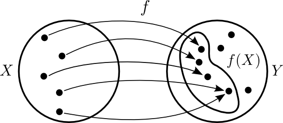
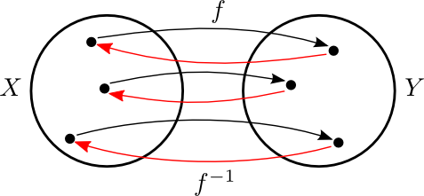
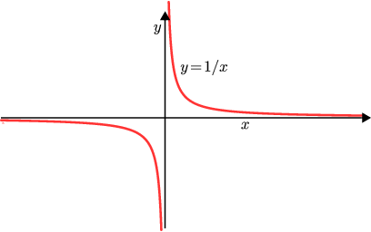

:Date:   10. september 2012

.. role:: math(raw)
   :format: html latex
..

.. contents::
   :depth: 3
..

Markgildi og samfelldni
=======================

Inngangur
---------

Viðfangsefnið
~~~~~~~~~~~~~

*There is a theory which states that if ever anybody discovers exactly
what the Universe is for and why it is here, it will instantly disappear
and be replaced by something even more bizarre and inexplicable. There
is another theory which states that this has already happened.* -Douglas
Adams

Stærðfræðigreining
~~~~~~~~~~~~~~~~~~

Grunnhugmyndin
^^^^^^^^^^^^^^

Stærðfræðigreining grundvallast á því að mæla breytingu (oft með tilliti
til tíma)

-  Eðlisfræði; hraði, hröðun, massi, orka, vinna, afl, þrýstingur

-  Rúmmál; flatarmál, rúmmál, lengd, massamiðja

-  Hagnýtingar; hagfræði, stofnstærðir, hámörkun/lágmörkun

-  Stærðfræði; markgildi, hermun, jafnvægisástand

Sagan
^^^^^

Sett fram samtímis, en óháð, af Isaac Newton og Gottfried Leibniz í lok
17. aldar.

|image|

Ítarefni
~~~~~~~~

Fyrir nánari útlistun á hugtökunum sem við fjöllum um þá er hægt að
skoða

-  `http://stæ.is <http://stae.is>`__ (hugtakasafn og orðaskrá)

-  http://planetmath.org

-  http://mathworld.wolfram.com

-  http://en.wikipedia.org (ath. enska útgáfan)

Forrit
~~~~~~

-  GeoGebra http://www.geogebra.org

-  WolframAlpha http://www.wolframalpha.com

Föll
----

Tölur
~~~~~

(i)   *Náttúrlegu tölurnar* eru tölurnar :math:`1, 2, 3, 4, \ldots` og
      mengi þeirra er táknað með :math:`{\mathbb  N}`.

(ii)  Mengi *heiltalna* er táknað með :math:`{\mathbb Z}`.
      :math:`{\mathbb Z}= \ldots,-2,-1,0,1,2,3,\ldots`

(iii) Mengi *ræðra talna* er táknað með :math:`{\mathbb Q}`.
      :math:`{\mathbb Q}= \{ \frac pq ; p,q \in {\mathbb Z}\}`.

(iv)  Mengi *rauntalna* er táknað með :math:`{\mathbb  R}`.

(v)   Mengi *tvinntalna* er táknað með :math:`{\mathbb  C}`.

Athugasemd
^^^^^^^^^^

Margir vilja telja :math:`0` með sem náttúrlega tölu. Það er eðlilegt ef
maður lítur á náttúrlegu tölurnar þannig að þær tákni fjölda. Ef maður
lítur hins vegar þannig á að þær séu notaðar til að númera hluti þá er 0
ekki með.

Smíði rauntalna
^^^^^^^^^^^^^^^

Rauntölur eru smíðaðar úr ræðu tölunum með því að fylla upp í götin.

T.d. eru

.. math::

   \begin{aligned}
   \pi &=& 3,1415926\ldots, \qquad \text{og}\\
   \sqrt 2 -4  &=& -2,58578\ldots\end{aligned}

ekki ræðar tölur (það er ekki hægt að skrifa þær sem brot
:math:`\frac ab`, þar sem :math:`a` og :math:`b` eru heilar tölur), en
þær eru rauntölur.

Frumsendan um efra mark
~~~~~~~~~~~~~~~~~~~~~~~

Látum :math:`A` vera mengi af rauntölum sem er þannig að til er tala
:math:`x`, þannig að fyrir allar tölur :math:`a \in A` þá er

.. math:: a\leq x.

Þá er til rauntala :math:`x_0` sem kallast *minnsta efra mark* fyrir
:math:`A`, sem er þannig að :math:`a\leq x_0` fyrir allar tölur
:math:`a\in
A` og ef :math:`x<x_0` þá er til tala :math:`a\in A` þannig að
:math:`a>x`.

Bil
~~~

Látum :math:`a` og :math:`b` vera rauntölur þannig að :math:`a<b`.
Skilgreinum

(i) *opið bil*  :math:`(a,b)=\{x\in {\mathbb  R}; a<x<b\}`

(ii) *lokað bil*  :math:`[a,b]=\{x\in {\mathbb  R}; a\leq x\leq b\}`

(iii) *hálf opið bil*  :math:`[a,b)=\{x\in {\mathbb  R}; a\leq x<b\}`

(iv) *hálf opið bil*  :math:`(a,b]=\{x\in {\mathbb  R}; a< x\leq b\}`

Þessi bil sem er skilgreind hér fyrir ofan eru kölluð endanleg. Til eru
fleiri gerðir af bilum:

(v) *opið óendanlegt bil*  
:math:`(a,\infty)=\{x\in {\mathbb  R}; a<x\}`

(vi) *opið óendanlegt bil*  
:math:`(-\infty, a)=\{x\in {\mathbb  R}; x<a\}`

(vii) *lokað óendanlegt bil*
  :math:`[a,\infty)=\{x\in {\mathbb  R}; a\leq x\}`

(viii) *lokað óendanlegt bil*  
:math:`(-\infty, a]=\{x\in {\mathbb  R}; x\leq a\}`

(ix) *allur rauntalnaásinn*   :math:`(-\infty, \infty)`.

Skilgreining
^^^^^^^^^^^^

Mengi :math:`A` af rauntölum kallast bil ef um allar tölur :math:`a<b`
sem eru í menginu :math:`A` gildir að ef :math:`a<x<b` þá er :math:`x`
líka í menginu :math:`A`. Þ.e. \ *engin göt*.

Athugasemd
^^^^^^^^^^

(i) Sérhvert bil á rauntalnaásnum er af einni þeirra gerða sem talin er
upp í Skilgreiningu 1.5. (Þessi staðhæfing er jafngild frumsendunni um
efra mark.)

(ii) Það er jafngilt að segja

.. math:: x \in (a-\eta,a+\eta)

og

.. math:: |x-a| < \eta.

Vörpun
~~~~~~

Skilgreining
^^^^^^^^^^^^

*Vörpun* frá mengi :math:`X` yfir í mengi :math:`Y` er regla sem
úthlutar sérhverju staki :math:`x` í :math:`X` nákvæmlega einu staki
:math:`f(x)` í :math:`Y`. Táknum þetta með :math:`f:X \to Y`.

Stakið :math:`f(x)` kallast *gildi* vörpunarinnar (í punktinum
:math:`x`).

Skilgreining
^^^^^^^^^^^^

Mengið :math:`X` kallast *skilgreiningarmengi* :math:`f`, mengið
:math:`Y` kallast *bakmengi* :math:`f` og mengið
:math:`f(X) = \{ f(x); x \in X \}` kallast *myndmengi* :math:`f`.

|image|

Samskeyting
~~~~~~~~~~~

Látum :math:`f:X \to Y` og :math:`g:Y \to Z` vera varpanir. Vörpunin
:math:`g\circ f:X \to Z` sem skilgreind er með
:math:`(g\circ f)(x)=g(f(x))` kallast *samskeyting* :math:`f` og
:math:`g`. Stakið :math:`g(f(x)) \in Z` fæst með því að beita fyrst
vörpuninni :math:`f` á stakið :math:`x` og síðan vörpuninni :math:`g` á
stakið :math:`f(x)`.

|image|

Eintækni/átækni
~~~~~~~~~~~~~~~

Það er ekki víst að öll gildin í :math:`Y` séu tekin (þ.e. :math:`f(X)`
getur verið minna en :math:`Y`). Eins þá er mögulegt að :math:`f` taki
sama gildið oftar en einu sinni.

Skilgreining
^^^^^^^^^^^^

Við segjum að vörpunin :math:`f` sé *átæk* ef :math:`f(X)=Y`, það þýðir
að fyrir sérhvert stak :math:`y` í :math:`Y` þá er til (amk. eitt) stak
:math:`x` í :math:`X` þannig að :math:`f(x)=y`.

Segjum að vörpunin :math:`f` sé *eintæk* ef :math:`f(x_1) = f(x_2)`
hefur í för með sér að :math:`x_1=x_2`, þ.e. sérhvert gildi sem vörpunin
tekur er bara tekið einu sinni.

|image|

Andhverfa
~~~~~~~~~

Skilgreining
^^^^^^^^^^^^

Vörpun sem er bæði eintæk og átæk kallast *gagntæk*.

Setning
^^^^^^^

Látum :math:`f:X \to Y` vera vörpun. Sagt er að :math:`f` sé
andhverfanleg ef til er vörpun :math:`f^{-1}:Y \to X` þannig að
samskeyting varpananna :math:`f` og :math:`f^{-1}` annars vegar og
:math:`f^{-1}` og :math:`f` hins vegar sé viðeigandi samsemdarvörpun,
þ.e. \ :math:`f^{-1}\circ f=id_X` og :math:`f\circ f^{-1} = id_Y`.

|image|

Graf
~~~~

Athugasemd
^^^^^^^^^^

Venjulega hjá okkur þá eru mengin :math:`X` og :math:`Y` mengi af
rauntölum. Þegar :math:`Y` er mengi af tölum þá er notast við orðið
*fall* í stað orðsins *vörpun*.

Skilgreining
^^^^^^^^^^^^

Látum :math:`f:X \to Y` vera fall þannig að :math:`X` og :math:`Y` eru
mengi af rauntölum. *Graf* fallsins :math:`f` er þá mengi allra punkta í
planinu :math:`{\mathbb  R}^2` af gerðinni :math:`(x,f(x))` þar sem
:math:`x\in X`. Notum oft :math:`y` í stað :math:`f(x)`.

|image|

Markgildi
---------

Óformleg skilgreining
~~~~~~~~~~~~~~~~~~~~~

Segjum að :math:`f(x)` *stefni á tölu :math:`L` þegar :math:`x` stefnir
á :math:`a`*, og ritum :math:`\lim_{x\rightarrow a} f(x)=L`, ef við
getum tryggt að :math:`f(x)` sé *eins nálægt* :math:`L` og við viljum
bara með því að velja :math:`x` *nógu nálægt* :math:`a`.

Skilgreining
~~~~~~~~~~~~

Gerum ráð fyrir að fall :math:`f` sé skilgreint á opnu bili umhverfis
punktinn :math:`a`, nema hvað hugsanlega er :math:`f(a)` ekki
skilgreint. Við segjum að :math:`f(x)` *stefni á tölu :math:`L` þegar
:math:`x` stefnir á :math:`a`*, og ritum
:math:`\lim_{x\rightarrow a} f(x)=L`, ef eftirfarandi skilyrði er
uppfyllt:

*Fyrir sérhverja tölu :math:`\varepsilon>0` er til tala :math:`\delta>0`
þannig að um öll :math:`x` þannig að*

.. math:: 0<|x-a|<\delta,\quad \text{ þá er } \quad |f(x)-L|<\varepsilon.

Athugasemd
~~~~~~~~~~

Þegar athugað er hvort markgildið :math:`\lim_{x\rightarrow a} f(x)` er
til og hvert gildi þess er þá skiptir ekki máli hvort :math:`f(a)` er
skilgreint eða ekki.

Markgildi frá hægri
~~~~~~~~~~~~~~~~~~~

Gerum ráð fyrir að fall :math:`f` sé skilgreint á opnu bili
:math:`(a,b)`. Segjum að :math:`f(x)` *stefni á tölu :math:`L` þegar
:math:`x` stefnir á :math:`a` frá hægri*, og ritum
:math:`\lim_{x\rightarrow a^+} f(x)=L`, ef við getum tryggt að
:math:`f(x)` sé *eins nálægt* :math:`L` og við viljum bara með því að
velja :math:`x>a` *nógu nálægt* :math:`a`.

Skilgreining
^^^^^^^^^^^^

Gerum ráð fyrir að fall :math:`f` sé skilgreint á opnu bili
:math:`(a,b)`. Við segjum að :math:`f(x)` *stefni á tölu :math:`L` þegar
:math:`x` stefnir á :math:`a` frá hægri*, og ritum
:math:`\lim_{x\rightarrow a^+} f(x)=L`, ef eftirfarandi skilyrði er
uppfyllt.

*Fyrir sérhverja tölu :math:`\varepsilon>0` er til tala :math:`\delta>0`
þannig að um öll :math:`x` þannig að*

.. math:: a<x<a+\delta,\quad \text{ þá er } \quad |f(x)-L|<\varepsilon.

Markgildi frá vinstri
~~~~~~~~~~~~~~~~~~~~~

Gerum ráð fyrir að fall :math:`f` sé skilgreint á opnu bili
:math:`(b,a)`. Segjum að :math:`f(x)` *stefni á tölu :math:`L` þegar
:math:`x` stefnir á :math:`a` frá vinstri*, og ritum
:math:`\lim_{x\rightarrow a^-} f(x)=L`, ef við getum tryggt að
:math:`f(x)` sé *eins nálægt* :math:`L` og við viljum bara með því að
velja :math:`x<a` *nógu nálægt* :math:`a`.

Skilgreining
^^^^^^^^^^^^

Gerum ráð fyrir að fall :math:`f` sé skilgreint á opnu bili
:math:`(b,a)`. Við segjum að :math:`f(x)` *stefni á tölu :math:`L` þegar
:math:`x` stefnir á :math:`a` frá vinstri*, og ritum
:math:`\lim_{x\rightarrow a^-} f(x)=L`, ef eftirfarandi skilyrði er
uppfyllt.

*Fyrir sérhverja tölu :math:`\varepsilon>0` er til tala :math:`\delta>0`
þannig að um öll :math:`x` þannig að*

.. math:: a-\delta<x<a,\quad \text{ þá er } \quad |f(x)-L|<\varepsilon.

Setning
~~~~~~~

Gerum ráð fyrir að fall :math:`f` sé skilgreint á opnu bili umhverfis
punktinn :math:`a`, nema hvað hugsanlega er :math:`f(a)` ekki
skilgreint. Þá er

.. math:: \lim_{x\rightarrow a} f(x)=L

ef og aðeins ef

.. math:: \lim_{x\rightarrow a^-} f(x)=L=\lim_{x\rightarrow a^+} f(x).

Önnur efnisatriði sem þið þurfið að skoða
~~~~~~~~~~~~~~~~~~~~~~~~~~~~~~~~~~~~~~~~~

-  Jafna línu, P.2

-  Jafna hrings, P.3

-  Hliðrun og skölun grafs, P.3

-  (Stranglega) minnkandi og (stranglega) vaxandi föll, 2.8

-  Jafnstæð og oddstæð föll, P.4

Algeng markgildi
~~~~~~~~~~~~~~~~

Dæmi
^^^^

-  :math:`\lim_{x \to a} c = c`, :math:`c` fasti

-  :math:`\lim_{x \to a} x = a`

-  :math:`\lim_{x \to a} |x| = |a|`

-  :math:`\lim_{x \to 0} \frac{|x|}{x}` er ekki til

-  :math:`\lim_{x \to 0^-} \frac{|x|}{x} = -1`

-  :math:`\lim_{x \to 0^+} \frac{|x|}{x} = 1`

Reiknireglur fyrir markgildi
~~~~~~~~~~~~~~~~~~~~~~~~~~~~

Setning
^^^^^^^

Gerum ráð fyrir að :math:`\lim_{x\rightarrow a}f(x)=L` og að
:math:`\lim_{x\rightarrow a}g(x)=M`. Þá gildir

(i)  :math:`\lim_{x\rightarrow a}\Big(f(x)+g(x)\Big)=L+M`;

(ii)   :math:`\lim_{x\rightarrow a}\Big(f(x)-g(x)\Big)=L-M`;

(iii)   :math:`\lim_{x\rightarrow a}f(x)g(x)=LM`;

(iv)   :math:`\lim_{x\rightarrow a}kf(x)=kL`, þar sem :math:`k` fasti;

(v)   :math:`\lim_{x\rightarrow a}f(x)/g(x)=L/M`, að því gefnu að
:math:`M\neq 0`;

(vi)  Gerum ráð fyrir að :math:`m` og :math:`n` séu heiltölur þannig að
:math:`f(x)^{m/n}` sé skilgreint fyrir öll :math:`x` á bili
:math:`(b,c)` umhverfis :math:`a` (en ekki endilega fyrir :math:`x=a`)
og að :math:`L^{m/n}` sé skilgreint. Þá er
:math:`\lim_{x\rightarrow a}f(x)^{m/n}=L^{m/n}`.

(vii)   Ef til er bil :math:`(b,c)` sem inniheldur :math:`a` þannig að
:math:`f(x)\leq g(x)` fyrir öll :math:`x\in (b,c)`, nema kannski
:math:`x=a`, þá er
:math:`\lim_{x\rightarrow a}f(x)=L\leq M=\lim_{x\rightarrow a}g(x)`.

VARÚÐ
~~~~~

Liður (i) í setningunni á undan segir að ef markgildin
:math:`\lim_{x\to a} f(x)` og :math:`\lim_{x\to a} g(x)` eru til þá sé
markgildið :math:`\lim_{x\to a} (f(x)+g(x))` einnig til.

En hún segir **ekki** að ef :math:`f` og :math:`g` eru föll þannig að
markgildið :math:`\lim_{x\to a} (f(x)+g(x))` er til, að þá séu
markgildin :math:`\lim_{x\to a} f(x)` og :math:`\lim_{x\to a} g(x)`
einnig til.

Klemmureglan
~~~~~~~~~~~~

(iv)-liður í setningu 2.2 að ofan
^^^^^^^^^^^^^^^^^^^^^^^^^^^^^^^^^

Ef til er bil :math:`(b,c)` sem inniheldur :math:`a` þannig að
:math:`f(x)\leq g(x)` fyrir öll :math:`x\in (b,c)`, nema kannski
:math:`x=a`, þá er
:math:`\lim_{x\rightarrow a}f(x)=L\leq M=\lim_{x\rightarrow a}g(x)`.

Setning.
^^^^^^^^

Gerum ráð fyrir að :math:`f(x)\leq
h(x)\leq g(x)` fyrir öll :math:`x` á bili :math:`(b, c)` sem inniheldur
:math:`a`, nema kannski :math:`x=a`. Gerum enn fremur ráð fyrir að

.. math:: \lim_{x\rightarrow a}f(x)=\lim_{x\rightarrow a}g(x)=L.

Þá er :math:`\lim_{x\rightarrow a}h(x)=L`.

Önnur efnisatriði sem þið þurfið að skoða
~~~~~~~~~~~~~~~~~~~~~~~~~~~~~~~~~~~~~~~~~

-  Margliður; deiling, þáttun og rætur, P.6

-  Tölugildisfallið, P.1

-  Þríhyrningsójafnan, P.1

-  Formerkjafallið, :math:`sgn(x)`, P.5

Mikilvæg markgildi
------------------

Markgildi þegar :math:`x` stefnir á :math:`\infty`
~~~~~~~~~~~~~~~~~~~~~~~~~~~~~~~~~~~~~~~~~~~~~~~~~~

|image|

Gerum ráð fyrir að fall :math:`f` sé skilgreint á bili
:math:`(a, \infty)`. Segjum að :math:`f(x)` *stefni á tölu :math:`L`
þegar :math:`x` stefnir á :math:`\infty`*, og ritum
:math:`\lim_{x\rightarrow \infty} f(x)=L`, ef við getum tryggt að
:math:`f(x)` sé eins *nálægt* :math:`L` og við viljum bara með því að
velja :math:`x` *nógu stórt*.

Skilgreining
^^^^^^^^^^^^

Gerum ráð fyrir að fall :math:`f` sé skilgreint á bili
:math:`(a,\infty)`. Við segjum að :math:`f(x)` *stefni á tölu :math:`L`
þegar :math:`x` stefnir á :math:`\infty`*, og ritum
:math:`\lim_{x\rightarrow \infty} f(x)=L`, ef eftirfarandi skilyrði er
uppfyllt

*fyrir sérhverja tölu :math:`\varepsilon>0` er til tala :math:`R` þannig
að um öll :math:`R<x` *

*gildir að :math:`|f(x)-L|<\varepsilon`.*

Markgildi þegar :math:`x` stefnir á :math:`-\infty`
~~~~~~~~~~~~~~~~~~~~~~~~~~~~~~~~~~~~~~~~~~~~~~~~~~~

Fyrir :math:`-\infty` er þetta gert með sama sniði.

Gerum ráð fyrir að fall :math:`f` sé skilgreint á bili
:math:`(-\infty, a)`. Segjum að :math:`f(x)` *stefni á tölu :math:`L`
þegar :math:`x` stefnir á :math:`-\infty`*, og ritum
:math:`\lim_{x\rightarrow -\infty} f(x)=L`, ef við getum tryggt að
:math:`f(x)` sé eins *nálægt* :math:`L` og við viljum bara með því að
velja :math:`x` sem *nógu stóra* mínus tölu.

Skilgreining
^^^^^^^^^^^^

Gerum ráð fyrir að fall :math:`f` sé skilgreint á bili
:math:`(-\infty,a)`. Við segjum að :math:`f(x)` *stefni á tölu :math:`L`
þegar :math:`x` stefnir á :math:`-\infty`*, og ritum
:math:`\lim_{x\rightarrow -\infty} f(x)=L`, ef eftirfarandi skilyrði er
uppfyllt

*fyrir sérhverja tölu :math:`\varepsilon>0` er til tala :math:`R` þannig
að um öll :math:`x<R` *

*gildir að :math:`|f(x)-L|<\varepsilon`.*

:math:`\infty` sem markgildi
~~~~~~~~~~~~~~~~~~~~~~~~~~~~

Gerum ráð fyrir að fall :math:`f` sé skilgreint á opnu bili umhverfis
punktinn :math:`a`, nema hvað hugsanlega er :math:`f(a)` ekki
skilgreint. Segjum að :math:`f(x)` *stefni á :math:`\infty` þegar
:math:`x` stefnir á :math:`a`*, og ritum
:math:`\lim_{x\rightarrow a} f(x)=\infty`, ef við getum tryggt að
:math:`f(x)` sé *hversu stórt sem við viljum* bara með því að velja
:math:`x` *nógu nálægt* :math:`a`.

Skilgreining
^^^^^^^^^^^^

Gerum ráð fyrir að fall :math:`f` sé skilgreint á opnu bili umhverfis
punktinn :math:`a`, nema hvað hugsanlega er :math:`f(a)` ekki
skilgreint. Við segjum að :math:`f(x)` *stefni á :math:`\infty` þegar
:math:`x` stefnir á :math:`a`*, og ritum
:math:`\lim_{x\rightarrow a} f(x)=\infty`, ef eftirfarandi skilyrði er
uppfyllt

*fyrir sérhverja tölu :math:`B` er til tala :math:`\delta>0` þannig að
um öll :math:`x` þannig að*

*:math:`0<|x-a|<\delta` gildir að :math:`f(x)>B`.*

Málvenja
~~~~~~~~

Athugið að :math:`\infty` er **ekki** tala. Þó að
:math:`\lim_{x\rightarrow a} f(x)=\infty` þá er samt sagt að markgildið
:math:`\lim_{x\rightarrow a} f(x)` sé ekki til.

:math:`-\infty` sem markgildi
~~~~~~~~~~~~~~~~~~~~~~~~~~~~~

Gerum ráð fyrir að fall :math:`f` sé skilgreint á opnu bili umhverfis
punktinn :math:`a`, nema hvað hugsanlega er :math:`f(a)` ekki
skilgreint. Segjum að :math:`f(x)` *stefni á :math:`-\infty` þegar
:math:`x` stefnir á :math:`a`*, og ritum
:math:`\lim_{x\rightarrow a} f(x)=-\infty`, ef við getum tryggt að
:math:`f(x)` sé *hversu lítið sem við viljum* bara með því að velja
:math:`x` *nógu nálægt* :math:`a`.

Skilgreining
^^^^^^^^^^^^

Gerum ráð fyrir að fall :math:`f` sé skilgreint á opnu bili umhverfis
punktinn :math:`a`, nema hvað hugsanlega er :math:`f(a)` ekki
skilgreint. Við segjum að :math:`f(x)` *stefni á :math:`-\infty` þegar
:math:`x` stefnir á :math:`a`*, og ritum
:math:`\lim_{x\rightarrow a} f(x)=-\infty`, ef eftirfarandi skilyrði er
uppfyllt

*fyrir sérhverja tölu :math:`B` er til tala :math:`\delta>0` þannig að
um öll :math:`x` þannig að*

*:math:`0<|x-a|<\delta` gildir að :math:`f(x)<B`.*

Málvenja
~~~~~~~~

Athugið að :math:`-\infty` er **ekki** tala. Þó að
:math:`\lim_{x\rightarrow a} f(x)=-\infty` þá er samt sagt að markgildið
:math:`\lim_{x\rightarrow a} f(x)` sé ekki til.

Markgildi með :math:`\sin`
~~~~~~~~~~~~~~~~~~~~~~~~~~

Sýnidæmi
^^^^^^^^

-  

   .. math:: \lim_{x\to 0} \sin\left(\frac 1x\right) \quad \text{er ekki til}

-  

   .. math:: \lim_{x\to 0} x\sin\left(\frac 1x\right) = 0

-  

   .. math:: \lim_{x \to 0} \frac{\sin(x)}{x} = 1

Samfelldni
----------

Skilgreining
~~~~~~~~~~~~

Látum :math:`A\subseteq {\mathbb  R}` og :math:`x\in A`. Við segjum að
:math:`x` sé *innri punktur* :math:`A` ef :math:`A` inniheldur opið bil
umhverfis :math:`x`, það er að segja til er tala :math:`\delta>0` þannig
að :math:`(x-\delta, x+\delta)\subseteq
A`.

Ef :math:`x` er ekki innri punktur :math:`A` og :math:`x\in A` þá segjum
við að :math:`x` sé *jaðarpunktur* :math:`A`.

Skilgreining.
~~~~~~~~~~~~~

Látum :math:`f` vera fall og :math:`c` innri punkt skilgreiningarsvæðis
:math:`f`. Sagt er að :math:`f` sé *samfellt í punktinum* :math:`c` ef

.. math:: \lim_{x\rightarrow c}f(x)=f(c).

Setning
~~~~~~~

Látum :math:`f` og :math:`g` vera föll. Gerum ráð fyrir að :math:`c` sé
innri punktur skilgreiningarsvæðis beggja fallanna og að bæði föllin séu
samfelld í punktinum :math:`c`. Þá eru eftirfarandi föll samfelld í
:math:`c`:

-  :math:`f+g`

-  :math:`f-g`

-  :math:`fg`

-  :math:`kf`, þar sem :math:`k` er fasti

-  :math:`f/g`, ef :math:`g(c)\neq 0`

-  :math:`\Big(f(x)\Big)^{1/n}`, að því gefnu að :math:`f(c)>0` ef
   :math:`n` er slétt tala og :math:`f(c)\neq 0` ef :math:`n<0`.

Samskeyting samfelldra falla
~~~~~~~~~~~~~~~~~~~~~~~~~~~~

Setning
^^^^^^^

Látum :math:`g` vera fall sem er skilgreint á opnu bili umhverfis
:math:`c` og samfellt í :math:`c` og látum :math:`f` vera fall sem er
skilgreint á opnu bili umhverfis :math:`g(c)` og samfellt í
:math:`g(c)`. Þá er fallið :math:`f\circ g` skilgreint á opnu bili
umhverfis :math:`c` og er samfellt í :math:`c`.

Hefð
~~~~

Ef fall er skilgreint með formúlu og skilgreingamengið er ekki tilgreint
sérstaklega, þá er venjan að líta alla þá punkta þar sem formúlan gildir
sem skilgreingarmengi fallsins

Samfelld föll
~~~~~~~~~~~~~

Við segjum að fall :math:`f` sé *samfellt* ef það er samfellt í
sérhverjum punkti skilgreingarmengisins.

Dæmi
^^^^

Eftirfarandi föll eru samfelld

-  margliður

-  ræð föll

-  ræð veldi

-  hornaföll; :math:`\sin`, :math:`\cos`, :math:`\tan`

-  tölugildisfallið :math:`|x|`

Að búa til samfelld föll
~~~~~~~~~~~~~~~~~~~~~~~~

Með því að nota föllin úr Dæmi 3.18 sem efnivið þá getum við búið til
fjölda samfelldra fall með því að beita aðgerðunum úr Setningu 3.14 og
Setningu 3.15.

Upprifjun
~~~~~~~~~

Skilgreining
^^^^^^^^^^^^

Látum :math:`f` vera fall og :math:`c` innri punkt skilgreiningarsvæðis
:math:`f`. Sagt er að :math:`f` sé *samfellt í punktinum* :math:`c` ef

.. math:: \lim_{x\rightarrow c}f(x)=f(c).

Athugasemd
^^^^^^^^^^

Þessi skilgreining virkað aðeins fyrir innri punkta
skilgreiningarsvæðisins. Hins vegar getum við útvíkkað skilgreininguna á
samfelldni fyrir hægri og vinstri endapunkta bila með því að einskorða
okkur við markgildi frá vinstri og hægri.

Hægri/vinstri samfelldni
~~~~~~~~~~~~~~~~~~~~~~~~

(i) Fall :math:`f` er *samfellt frá hægri í punkti* :math:`c` ef
:math:`\lim_{x\rightarrow c^+}f(x)=f(c)`.

Hér er gert ráð fyrir að fallið :math:`f` sé amk. skilgreint á bilinu
:math:`[c, a)`.

(ii) Fall :math:`f` er *samfellt frá vinstri í punkti* :math:`c` ef
:math:`\lim_{x\rightarrow c^-}f(x)=f(c)`.

Hér er gert ráð fyrir að fallið :math:`f` sé amk. skilgreint á bilinu
:math:`(a, c]`.

Samfelld föll
~~~~~~~~~~~~~

Skilgreining (uppfærð)
^^^^^^^^^^^^^^^^^^^^^^

Gerum ráð fyrir að :math:`f` sé fall sem er skilgreint á mengi
:math:`A`, þar sem :math:`A` er sammengi endanlega margra bila. Við
segjum að fallið :math:`f` sé *samfellt* ef það er samfellt í öllum
innri punktum skilgreingarmengisins, og ef það er samfellt frá
hægri/vinstri í jaðarpunktum skilgreingarmengisins, eftir því sem við á.

Athugasemd
^^^^^^^^^^

Ef fall er samfellt á opnu bili :math:`(a,b)`, og ef :math:`a<c<d<b`, þá
er fallið einnig samfellt á bilinu :math:`[c,d]`.

Há- og lággildislögmálið
~~~~~~~~~~~~~~~~~~~~~~~~

Setning
^^^^^^^

Látum :math:`f` vera samfellt fall skilgreint á lokuðu takmörkuðu bili
:math:`[a,b]`. Þá eru til tölur :math:`x_1` og :math:`x_2` í
:math:`[a,b]` þannig að fyrir allar tölur :math:`x` í :math:`[a,b]` er

.. math:: f(x_1)\leq f(x)\leq f(x_2).

Þetta þýðir að samfellt fall :math:`f` á lokuðu og takmörkuðu bili
:math:`[a,b]` tekur bæði hæsta og lægsta gildi á bilinu. Hæsta gildið er
þá :math:`f(x_2)` og lægsta gildið er :math:`f(x_1)`.

Athugasemd
^^^^^^^^^^

Það er mögulegt að fallið taki há/lággildi sitt í fleiri en einum
punkti.

Milligildissetningin
~~~~~~~~~~~~~~~~~~~~

Setning
^^^^^^^

Látum :math:`f` vera samfellt fall skilgreint á lokuðu takmörkuðu bili
:math:`[a,b]`. Gerum ráð fyrir að :math:`s` sé tala sem liggur á milli
:math:`f(a)` og :math:`f(b)`. Þá er til tala :math:`c` sem liggur á
milli :math:`a` og :math:`b` þannig að :math:`f(c)=s`.

<iframe scrolling=“no”
src=“https://tube.geogebra.org/material/iframe/id/zEQQcGcQ/width/1075/height/767/border/888888/rc/false/ai/false/sdz/true/smb/false/stb/false/stbh/true/ld/false/sri/true/at/auto”
width=“1075px” height=“767px” style=“border:0px;”> </iframe>>

|image|

Fylgisetning
^^^^^^^^^^^^

Ef :math:`P(x)=a_nx^n+a_{n-1}x^{n-1}+\cdots+a_1x+a_0` er margliða af
oddatölu stigi, þá er til rauntala :math:`c` þannig að :math:`P(c)=0`.

**Sönnun** Gerum ráð fyrir að :math:`a_n>0`. Þá er
:math:`\lim_{x\to -\infty} P(x) = -\infty` og
:math:`\lim_{x\to \infty} P(x) = \infty`.Það þýður að til eru tölur
:math:`a` og :math:`b` þannig að :math:`P(a)<0` og :math:`P(b)>0`. Með
því að beita Milligildissetningunni á fallið :math:`P` á bilinu
:math:`[a,b]` og með :math:`s=0` þá fæst að til er núllstöð á bilinu
:math:`[a,b]`.

Ef :math:`a_n < 0` þá víxlast markgildin að ofan en röksemdafærslan er
að öðru leyti eins.

.. |image| image:: ./myndir/kafli01/01_NewtonLeibniz.jpg

.. |image| image:: ./myndir/kafli01/02_Samskeyting.png

.. |image| image:: ./myndir/kafli01/03_liminf.png
.. |image| image:: ./myndir/kafli01/04_Milligildissetn.png
